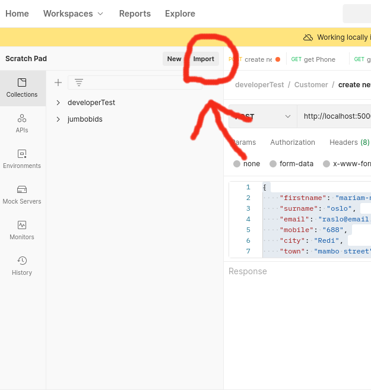
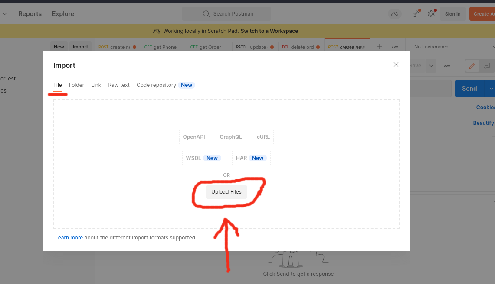
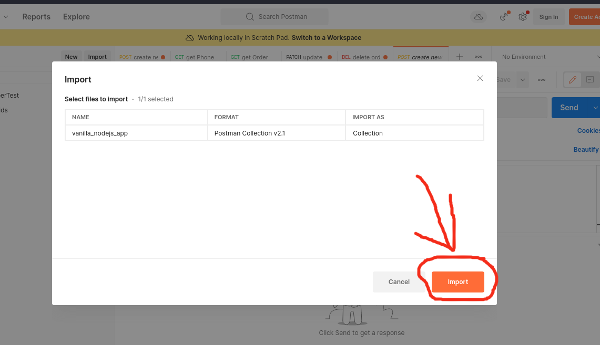

# Vanilla NodeJs Application

This ia a vanilla **nodejs application** using [mongoDB driver](https://www.npmjs.com/package/mongodb) and built in `http server` core module.

### Getting started

- Run `npm install` to install necessary dependecies
- To start the application in `development` Environment run `npm run dev`.
- Open you favourite http client tool to test APIs. An example of http client is [postman](https://www.postman.com/downloads/).
- If you use postman, you can **import into Postman** a JSON file named: **postman_collection.json** at the root of the project folder to get you started with endpoints for this application.
    
    - Open your Postman app and locate th import button as shown in the image

        
          

    - A modal should pop up and just ensure you are on the file tab. Then click the button `upload files` illustrated in image below

        
          

    - Click the button upload files and select our **postman_collection.json** file which is located at the root of our project. From there you should just `import`. **The orange button on the bottom right of the open modal**.

        
          

- To seed the database with some dummy data you can run `npm run seeddb`.
- Include an `.env` file to override the default configurations. Refer entries of `.env` from `.env.example`.

You can switch to using mongoose as ODM. Just check the file imports to load the `mongoose` ones.
Leave a star⭐ and Happy coding!
